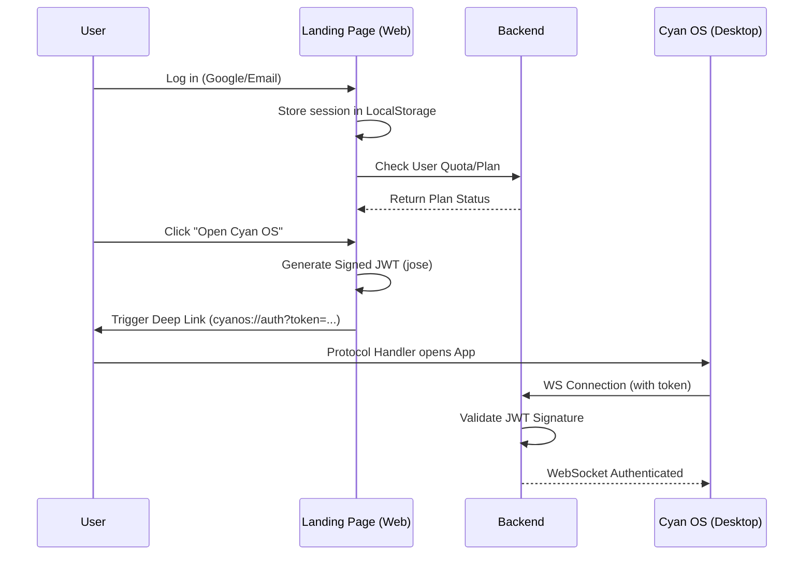

# Cyan OS Authentication Token Flow

This document describes the authentication flow between the Cyan OS Landing Page (Web) and the Cyan OS Desktop App (Electron) via the Backend.

## Overview

The authentication flow is designed to securely pass user session information from the web landing page to the desktop application using a signed JSON Web Token (JWT) transmitted via a custom protocol deep link.

## Step-by-Step Flow

### 1. User Authentication
The landing page supports Google OAuth and Email-based login. Upon successful authentication, a `UserSession` object is created and stored in the browser's `localStorage` under the key `user_session`.

### 2. Session Synchronization
The landing page periodically synchronizes the user's subscription status by calling:
`GET ${BACKEND_URL}/api/user/quota?user_id=${userId}`
This ensures the `plan` claim in the generated token is up-to-date.

### 3. JWT Token Generation
When the user clicks to open the desktop app, the `openAppWithToken` function (in `src/App.tsx`) generates a JWT:

- **Library**: `jose` (`SignJWT`)
- **Secret**: `VITE_JWT_SECRET` (UTF-8 encoded)
- **Algorithm**: `HS256`
- **Claims**:
  - `user_id`: Unique identifier for the user.
  - `email`: User's email address.
  - `username`: User's display name.
  - `plan`: Current subscription plan (e.g., `free`, `pro`).
- **Expiration**: 7 days (`7d`).

### 4. Deep Link Transmission
The generated token is appended to a custom protocol URL:
`cyanos://auth?userId=${userId}&plan=${plan}&token=${token}`

The browser initiates a redirect to this URL, which is handled by the Cyan OS Desktop application.

### 5. Backend Validation
The Cyan OS Desktop app uses this token to authenticate WebSocket connections (e.g., for Speech-to-Text). The backend validates the token using the same `JWT_SECRET` stored in its environment.

## Security Considerations

- **Secret Synchronization**: The `VITE_JWT_SECRET` on the frontend MUST match the `JWT_SECRET` on the backend.
- **Token Expiry**: Tokens are valid for 7 days to balance convenience and security.
- **Signing**: Tokens are signed on the client-side. While client-side signing requires the secret to be present in the frontend build, it is necessary for the deep-link "bridge" flow where the web app acts as the issuer for the desktop client.

## Code Reference
The core logic resides in `src/App.tsx` within the `openAppWithToken` function.
